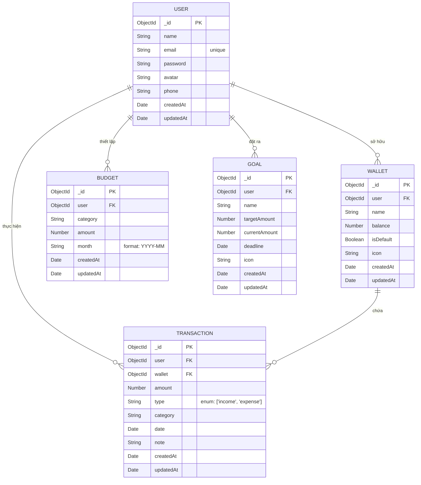

# Cấu trúc Database (MongoDB) - Finance Tracker

Vì chúng ta sử dụng **MongoDB** (cơ sở dữ liệu NoSQL), cấu trúc bảng không được định nghĩa bằng các câu lệnh `CREATE TABLE` như SQL, mà được định nghĩa thông qua các **Mongoose Schema** (đã được tạo sẵn trong thư mục `backend/models`). 

Khi server chạy và có dữ liệu đầu tiên được thêm vào, MongoDB sẽ tự động tạo ra các "collection" (tương đương với các bảng trong SQL) dựa trên Schema này.

Dưới đây là sơ đồ cấu trúc và mối quan hệ của các bảng (collections) để bạn đưa cho bạn của bạn xem nhằm nắm rõ Database.

## Sơ đồ quan hệ (ERD Diagram)

## Chi tiết các Collection (Bảng)

### 1. Collection `users`
Lưu trữ thông tin tài khoản người dùng.
- `_id`: ID tự động sinh.
- `name` (String): Họ và tên.
- `email` (String): Bắt buộc, duy nhất.
- `password` (String): Đã được mã hóa bcrypt.

### 2. Collection `wallets`
Quản lý các nguồn tiền (ví, thẻ ATM, thẻ tín dụng).
- `user` (ObjectId): Trỏ tới `_id` của user sở hữu ví này.
- `name` (String): Tên ví (VD: Tiền mặt, Thẻ tín dụng).
- `balance` (Number): Số dư hiện tại.
- `isDefault` (Boolean): Có phải ví mặc định không.

### 3. Collection `transactions`
Lưu trữ toàn bộ biến động số dư.
- `user` (ObjectId): Giao dịch của ai.
- `wallet` (ObjectId): Giao dịch bằng ví nào.
- `amount` (Number): Số tiền.
- `type` (String): Chỉ nhận 2 giá trị `income` (thu) hoặc `expense` (chi).
- `category` (String): Danh mục (VD: Ăn uống, Mua sắm).
- `date` (Date): Ngày thực hiện giao dịch.

### 4. Collection `budgets`
Giới hạn chi tiêu theo tháng.
- `user` (ObjectId): Ngân sách của ai.
- `category` (String): Áp dụng cho danh mục nào (VD: Ăn uống).
- `amount` (Number): Hạn mức tiền tối đa.
- `month` (String): Tháng áp dụng (VD: "2025-06").

### 5. Collection `goals`
Mục tiêu tài chính tương lai.
- `user` (ObjectId): Của user nào.
- `name` (String): Tên mục tiêu (VD: Du lịch).
- `targetAmount` (Number): Số tiền cần đạt.
- `currentAmount` (Number): Số tiền đã tích lũy.
- `deadline` (Date): Ngày hạn chót.
